 # Proyecto Final - Docker & Kubernetes

   - Alumno: Ronald Choque Fuentes
   - Fecha: 28-10-2025
   - Curso: Docker & Kubernetes - i-Quattro

   ## Links de Docker Hub
   - Backend v2.1: https://hub.docker.com/r/ronaldchoque/springboot-api/tags
   - Frontend v2.2: https://hub.docker.com/r/ronaldchoque/angular-frontend/tags


### Entregables Parte 1

```bash
microk8s status
```

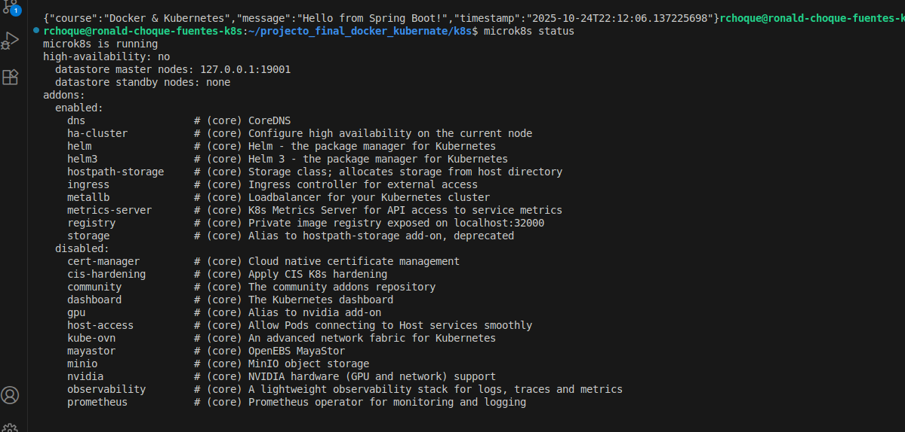

```bash
kubectl get all -n proyecto-integrador
```
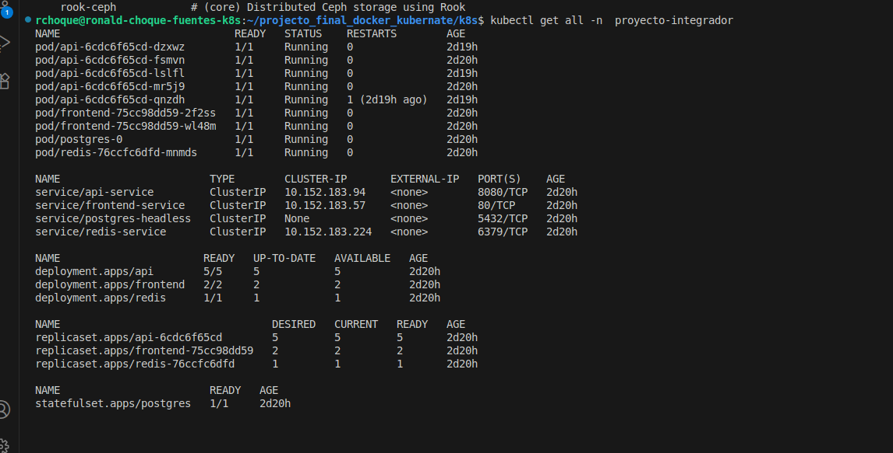

Localhost browser

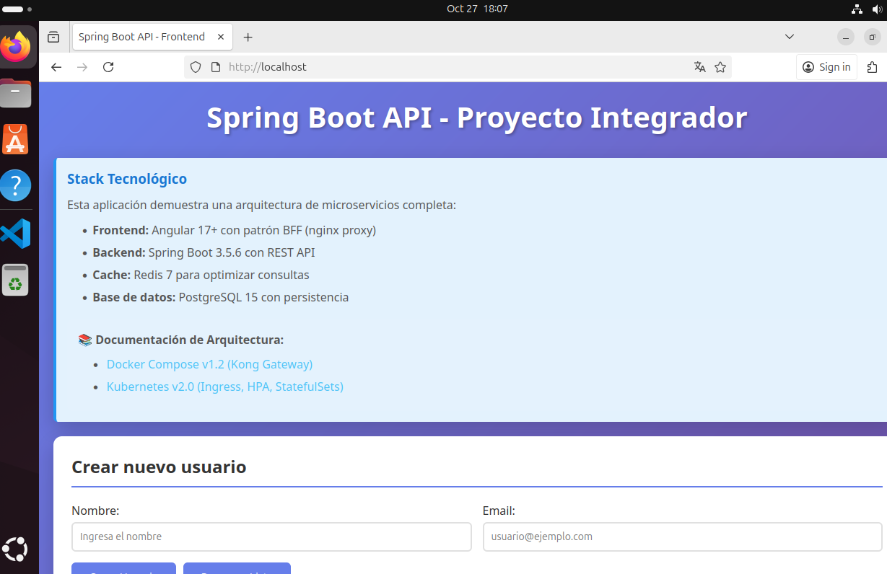

Virtual Box Configuration

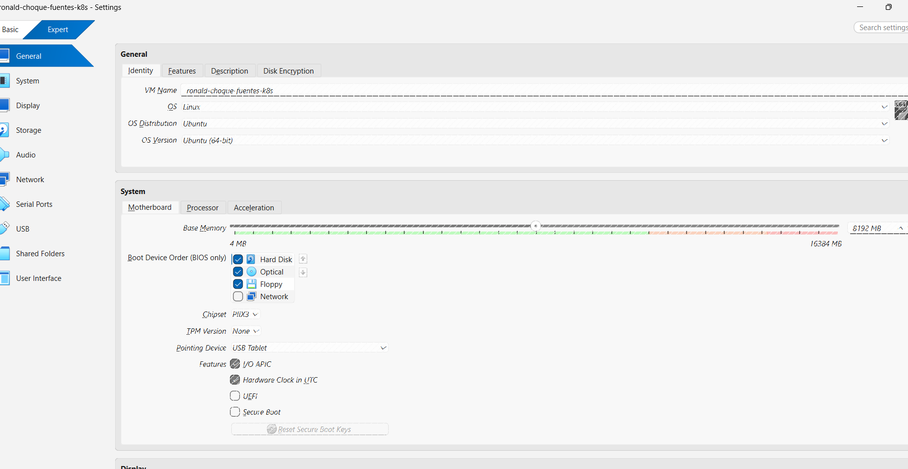

---

## Parte 2: Iteración v2.1 - Modificar Backend
### Objetivo
Agregar un nuevo endpoint en el backend, versionar la imagen como v2.1, publicarla en tu Docker Hub y actualizar el deployment.
### Tareas

#### 2.1 Agregar Nuevo Endpoint

Editar el archivo: `src/main/java/dev/alefiengo/api/controller/GreetingController.java`

Agregar el siguiente método:

```java
@GetMapping("/api/info")
public ResponseEntity<Map<String, Object>> getInfo() {
    Map<String, Object> info = new HashMap<>();
    info.put("alumno", "RONALD CHOQUE FUENTES");
    info.put("version", "v2.1");
    info.put("curso", "Docker & Kubernetes - i-Quattro");
    info.put("timestamp", LocalDateTime.now().toString());
    info.put("hostname", System.getenv("HOSTNAME"));
    return ResponseEntity.ok(info);
}
```


#### 2.2 Build Imagen Docker v2.1

```bash
# Build imagen (reemplaza 'tu-usuario' con tu username de Docker Hub)
docker build -t ronaldchoque/springboot-api:v2.1 .

# Verificar imagen
docker images | grep springboot-api
```

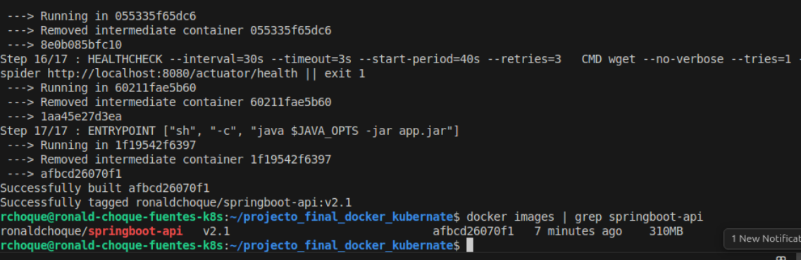

#### 2.3 Push a Docker Hub

```bash
# Push
docker ronaldchoque/springboot-api:v2.1
# Verificar en https://hub.docker.com/r/ronaldchoque/springboot-api/tags
```
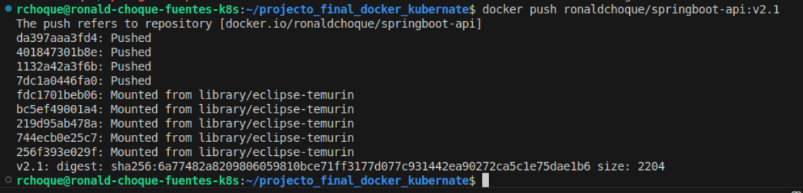

![alt text]screenshoots/parte_02/image-2.png)

#### 2.4 Actualizar Deployment de Kubernetes

Editar: `k8s/05-backend/api-deployment.yaml`

Buscar y cambiar la imagen del contenedor `api`:
```yaml
# Antes:
image: alefiengo/springboot-api:v2.0

# Después:
image: ronaldchoque/springboot-api:v2.1
```

#### 2.5 Aplicar Cambios

```bash
# Aplicar el deployment actualizado
kubectl apply -f k8s/05-backend/api-deployment.yaml


# Ver el estado del rollout
kubectl rollout status deployment/api -n proyecto-integrador

# Ver los pods actualizándose
kubectl get pods -n proyecto-integrador -w
```

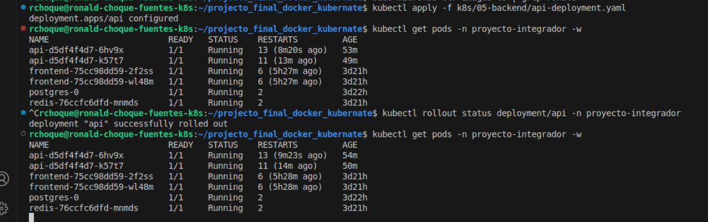


#### 2.6 Verificar Funcionamiento

```bash
# Opción 1: Port-forward
kubectl port-forward -n proyecto-integrador svc/api-service 8080:8080

# En otra terminal
curl http://localhost:8080/api/info

# Opción 2: Via Ingress
curl http://<IP-METALLB>/api/info
```

**Salida esperada:**
```json
{
  "alumno": "Tu Nombre",
  "version": "v2.1",
  "curso": "Docker & Kubernetes - i-Quattro",
  "timestamp": "2025-01-17T10:30:00",
  "hostname": "api-xxxx-yyyy"
}
```

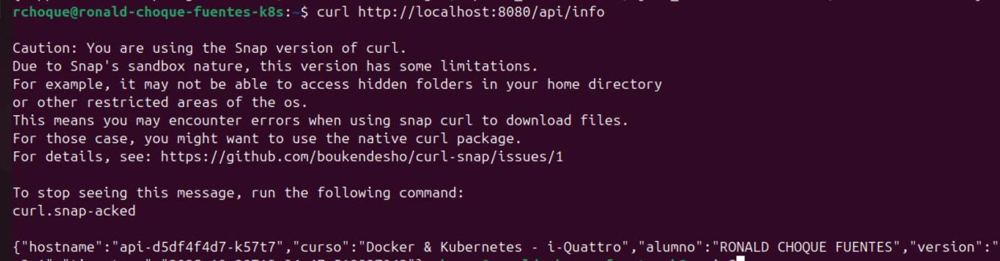

#### 2.7 Crear Tag en Git

```bash
git add .
git commit -m "feat: add info endpoint for v2.1"
git tag -a v2.1 -m "Backend v2.1 con endpoint /api/info"

```
### Entregables Parte 2

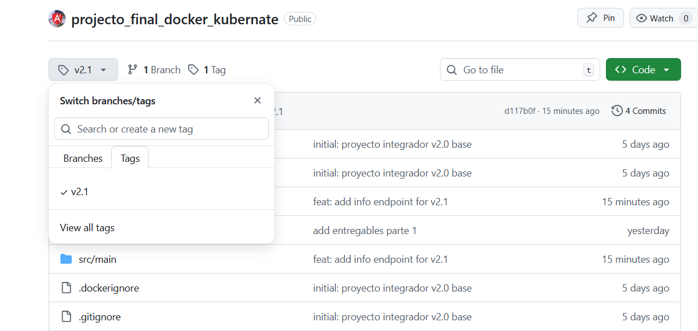

```bash
docker images
```
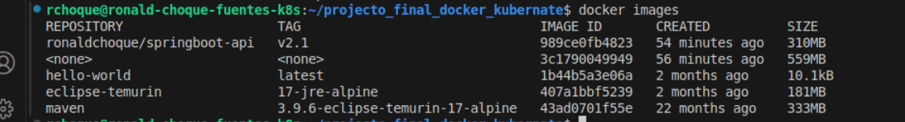


https://hub.docker.com/r/ronaldchoque/springboot-api/tags

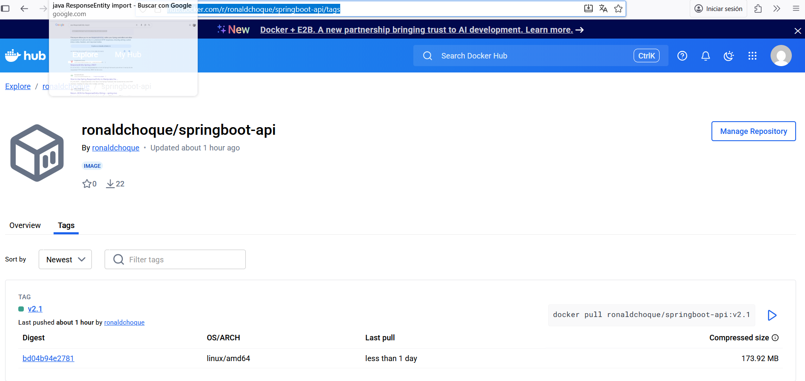

GET POTS
```bash
kubectl get pods -n proyecto-integrador -w
```
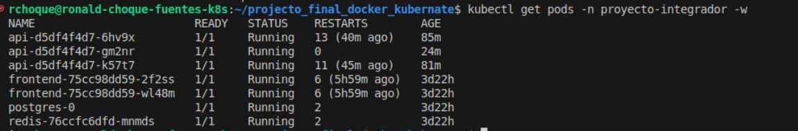

- Screenshot o output de `curl http://<IP-METALLB>/api/info` mostrando la respuesta JSON
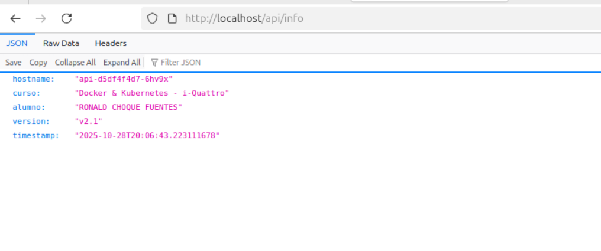

Screenshot de `kubectl rollout status` durante la actualización

```bash
kubectl rollout status deployment/api -n proyecto-integrador
```
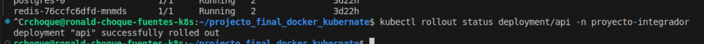
---
## Parte 3: Iteración v2.2 - Modificar Frontend (25%)

### Objetivo
Agregar funcionalidad en el frontend para consumir el nuevo endpoint `/api/info`, versionar como v2.2 y desplegar.


### Entregables Parte 3
- Código modificado de Angular (screenshots de .html y .ts)
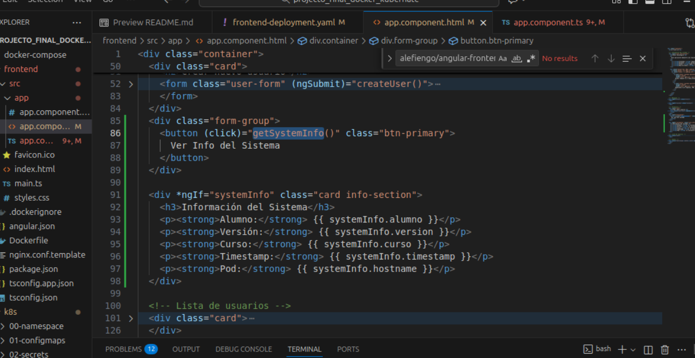
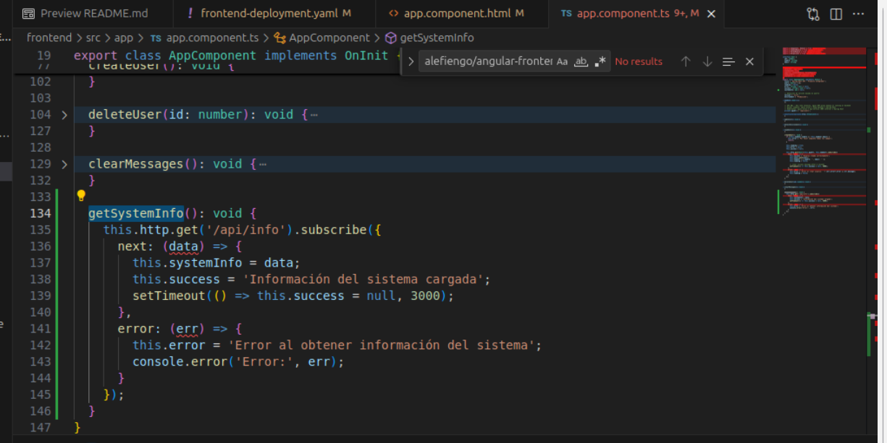

- Link a tu imagen en Docker Hub: `https://hub.docker.com/r/ronaldchoque/angular-frontend/tags`

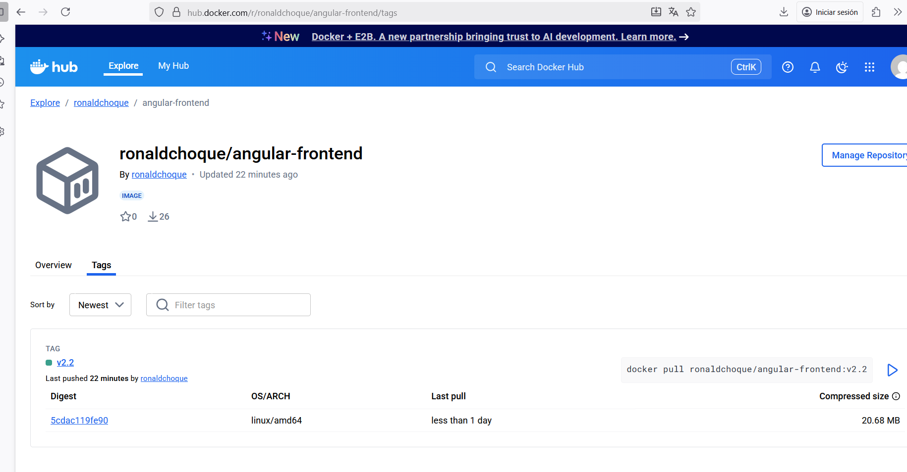

- Screenshot de `kubectl get pods -n proyecto-integrador -l app=frontend` durante el rolling update del frontend
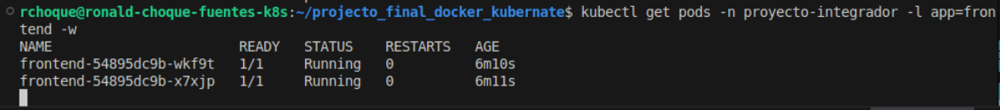
- Screenshot del navegador mostrando el botón "Ver Info del Sistema"
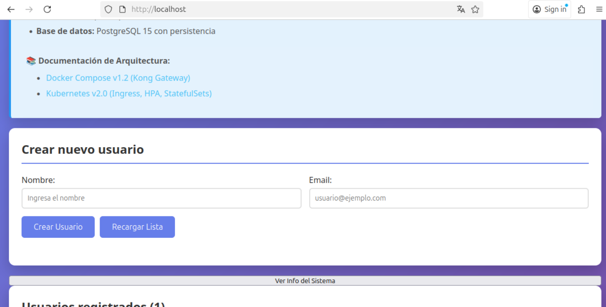
- Screenshot del navegador mostrando la información del sistema cargada
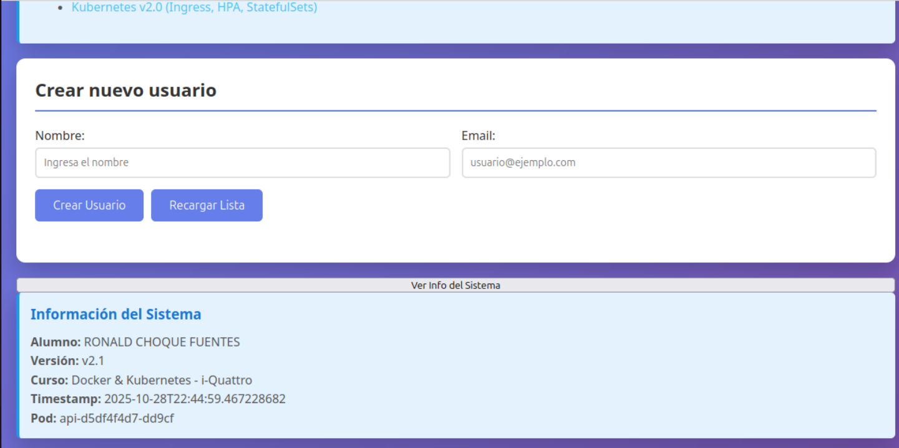
---
---

## Parte 4: Gestión de Versiones con Rollout (20%)

### Objetivo
Aprender a gestionar versiones de deployments usando comandos de rollout (rollback, rollforward, historial).

### Entregables Parte 4
- Screenshot de `kubectl rollout history` del backend
```bash
# Ver historial actualizado
kubectl rollout history deployment/api -n proyecto-integrador
```
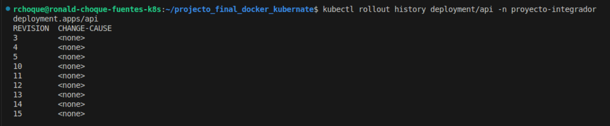

- Screenshot de `kubectl rollout history` del frontend
```bash
# Ver historial del frontend
kubectl rollout history deployment/frontend -n proyecto-integrador
```
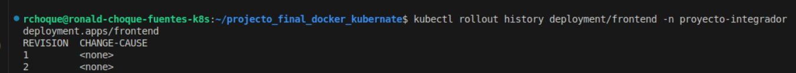
- Screenshot del proceso de rollback (undo)

```bash
# Rollback del backend a v2.0
kubectl rollout undo deployment/api -n proyecto-integrador
```
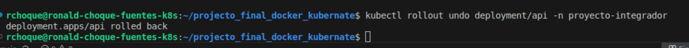
regrtesamos aun cambio anterior

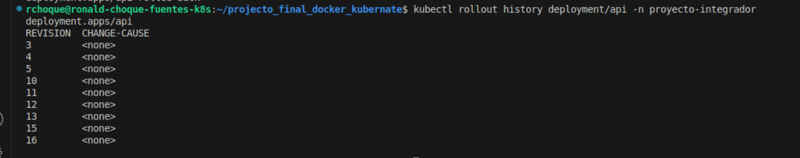
esto se refleja en el history  dond e se agrega una nueva revision

- Screenshot verificando que `/api/info` dejó de funcionar después del rollback
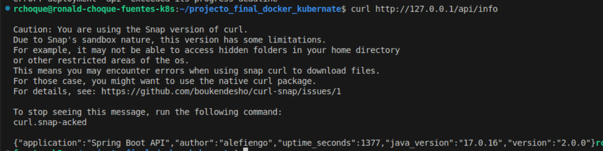
este obtine el old response de /api/info

- Screenshot del rollforward (undo --to-revision=2)
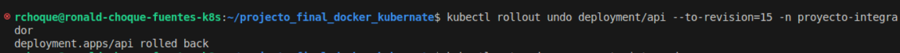

- Screenshot verificando que `/api/info` volvió a funcionar

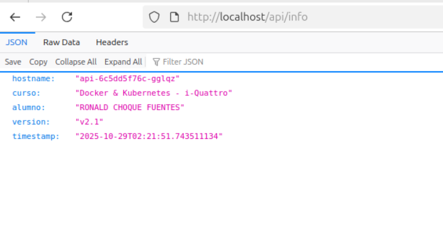

- Explicación en tus propias palabras: ¿Qué hace `kubectl rollout undo`?
-- Regresa a un deployment anterior al actual.

---

## Parte 5: Acceso Externo via Ingress + MetalLB (15%)

### Objetivo
Verificar que el acceso externo funciona correctamente sin necesidad de port-forward, simulando un entorno cloud real.


### Entregables Parte 5
- Screenshot de `kubectl get ingress` mostrando la IP asignada
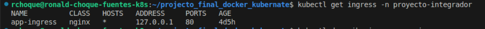

- Screenshot de `kubectl describe ingress` mostrando las rutas configuradas
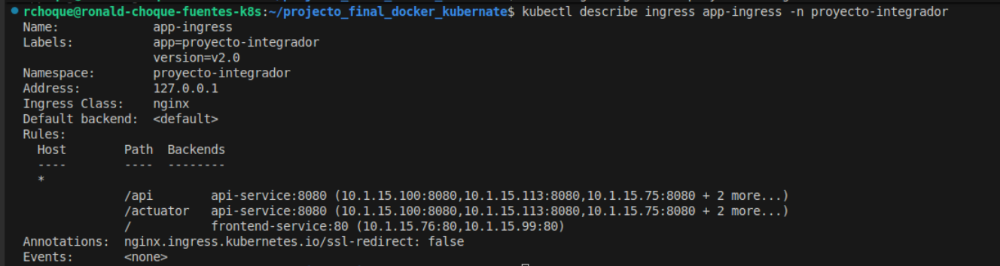


- Screenshot del navegador accediendo a `http://<IP-METALLB>/` (frontend)
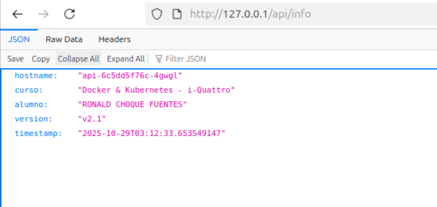

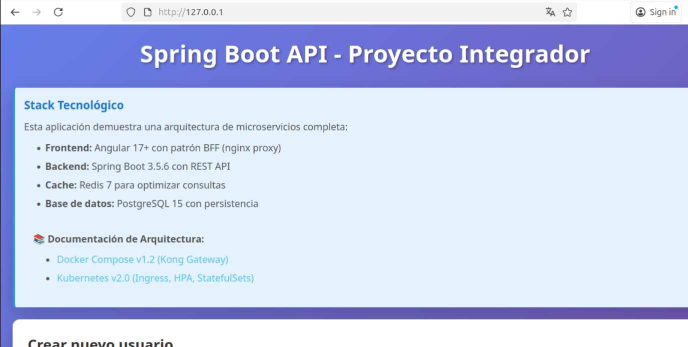

- Screenshot de curl a `/api/info` desde la IP de MetalLB

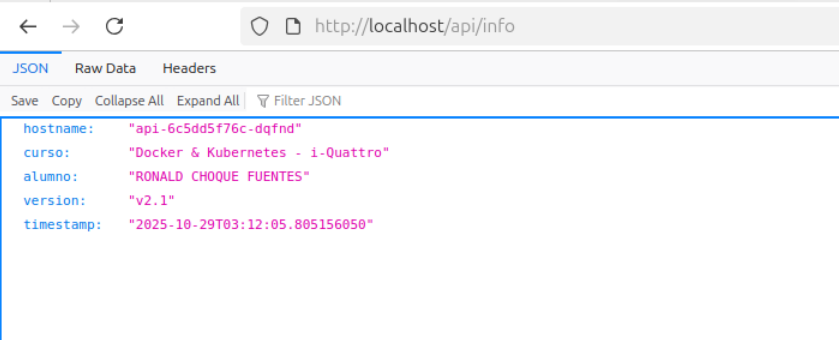

- Screenshot de curl a `/actuator/health` mostrando status UP
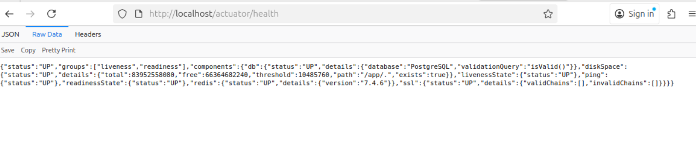

- IP del Ingress (anotar)
-  127.0.0.1

---